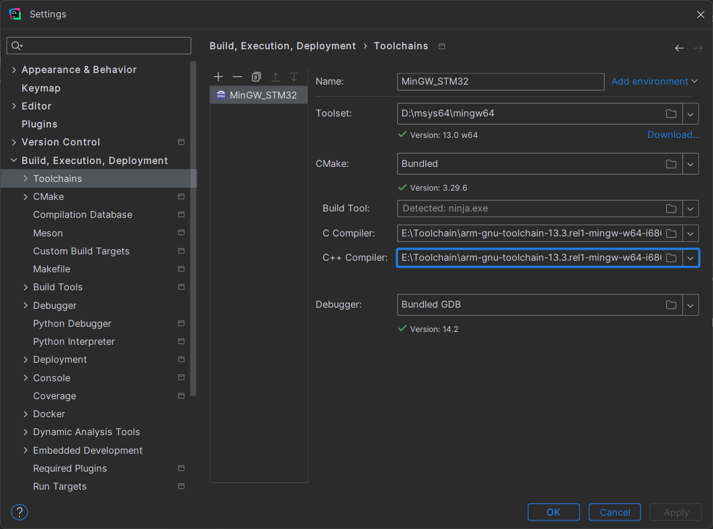
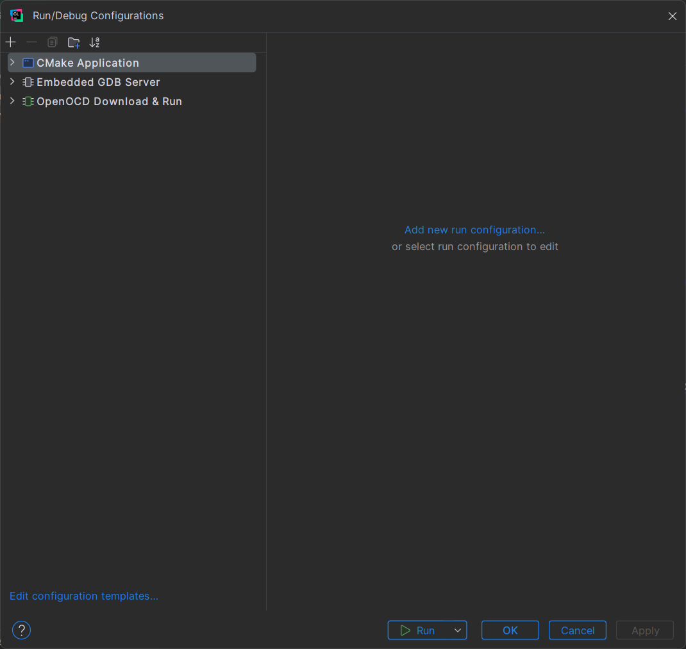
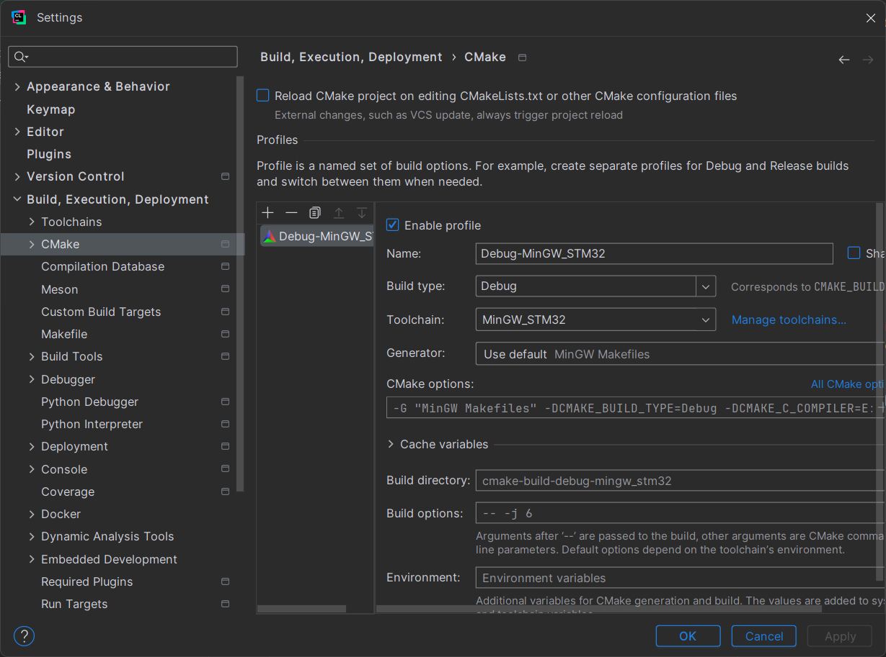
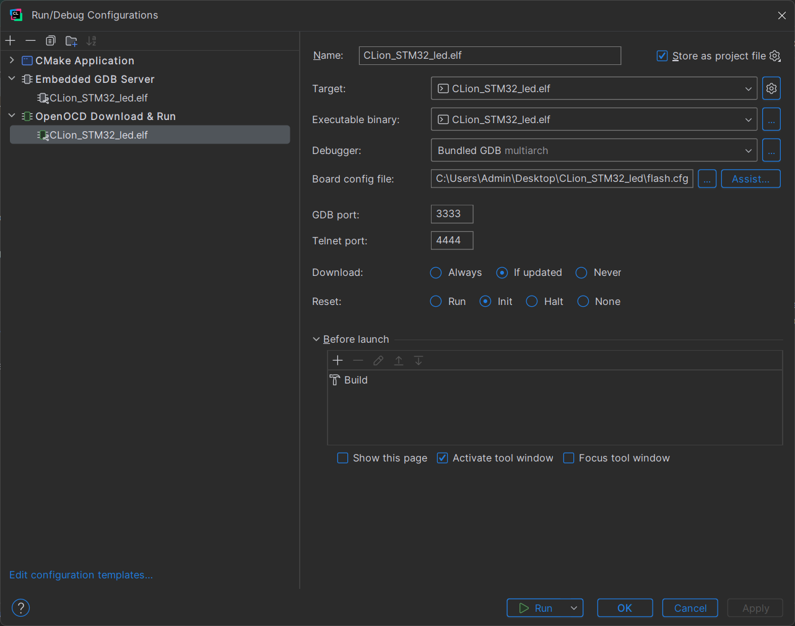
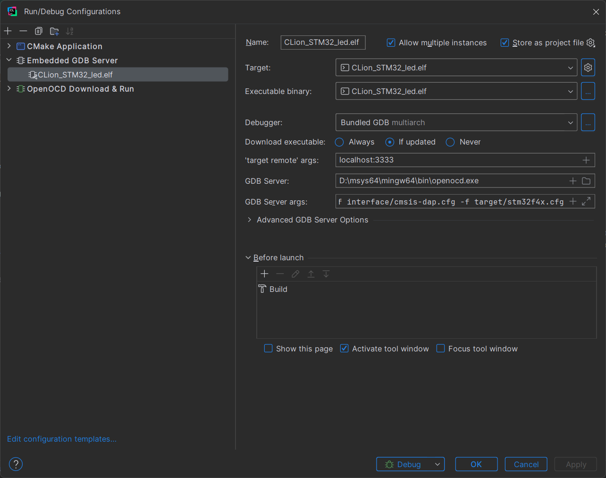

# Toolchain Needed
- MSYS2
  - openocd 
  - make 
  - cmake
  - mingw64

# Configs 4 Project
- choose stm32cubeide while generating code in the toolchain TAB(of course in stm32cubemx) 

# Toolchain Configs
- Toolchains_MinGW
- General_View
- CMake
- Flashing
- Debugging
